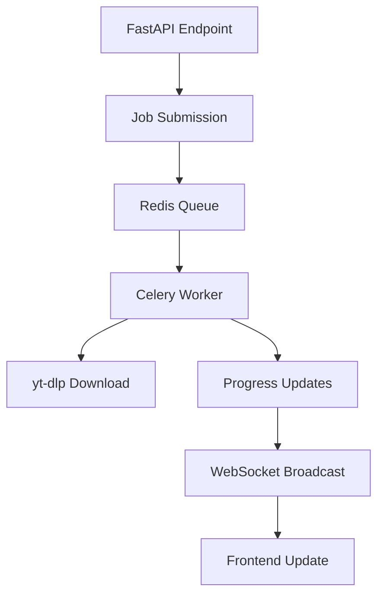
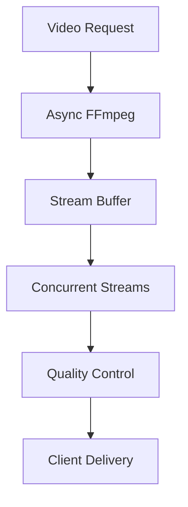

# 🚀 **PHASE 2: MEDIA PROCESSING OPTIMIZATION**

**Start Date**: September 3, 2025  
**Status**: 🔄 **ACTIVE** - Phase 2 Beginning  
**Duration**: 12 weeks (Weeks 15-26)  
**Primary Objective**: Eliminate longest blocking operations with background job system

---

## 🎯 **PHASE 2 EXECUTIVE SUMMARY**

Phase 2 focuses on the **highest impact optimization**: converting long-running media processing operations from blocking synchronous calls to distributed background jobs. This phase targets the remaining **15% of blocking operations** that have the largest performance impact.

### **🎯 PRIMARY TARGETS**
- **yt-dlp video downloads**: 30-300 second blocking operations → Background jobs
- **FFmpeg streaming**: Continuous blocking operations → Async subprocess generators  
- **Image processing**: 1-5 second PIL/OpenCV operations → Thread pool executors
- **Bulk metadata enrichment**: Sequential processing → Distributed parallel jobs

### **📊 EXPECTED OUTCOMES**
- 🎯 **Zero blocking operations** in video downloads
- 🎯 **100x improvement** in download handling capacity  
- 🎯 **Real-time progress tracking** via WebSocket updates
- 🎯 **Concurrent video streaming** capability
- 🎯 **Complete non-blocking** media processing pipeline

---

## 📅 **PHASE 2 WEEKLY BREAKDOWN**

### **🏗️ WEEK 15-18: Background Job Queue System** (HIGHEST IMPACT)

**Objective**: Eliminate blocking yt-dlp downloads with Celery + Redis

#### **Week 15: Redis & Celery Infrastructure**
**Goal**: Set up distributed job queue foundation
- Install and configure Redis server
- Set up Celery workers and task definitions
- Create job queue management utilities
- Implement basic job status tracking

**Deliverables**:
- `src/jobs/celery_app.py` - Celery application configuration
- `src/jobs/redis_manager.py` - Redis connection and management
- `src/jobs/base_task.py` - Base task class with common patterns
- `docker-compose.redis.yml` - Redis infrastructure setup

#### **Week 16: yt-dlp Background Job Conversion**
**Goal**: Convert video downloads to non-blocking background jobs  
- Create yt-dlp download task definitions
- Implement job progress tracking and callbacks
- Convert video download endpoints to job submission
- Add job status API endpoints

**Deliverables**:
- `src/jobs/video_download_tasks.py` - Celery tasks for video downloads
- `src/api/fastapi/jobs.py` - Job management API endpoints
- `src/jobs/progress_tracker.py` - Real-time progress tracking
- Background job status dashboard integration

#### **Week 17: Bulk Operations Background Jobs**
**Goal**: Convert batch operations to distributed processing
- Metadata enrichment background jobs
- Playlist import background jobs  
- Video indexing background jobs
- Artist discovery background jobs

**Deliverables**:
- `src/jobs/metadata_tasks.py` - Bulk metadata processing tasks
- `src/jobs/playlist_tasks.py` - Playlist import background jobs
- `src/jobs/discovery_tasks.py` - Artist/video discovery tasks
- Job scheduling and retry logic implementation

#### **Week 18: WebSocket Progress Integration**
**Goal**: Real-time job progress updates to frontend
- WebSocket server integration with FastAPI
- Job progress broadcasting system
- Frontend WebSocket client integration
- Real-time job dashboard updates

**Deliverables**:
- `src/websockets/job_progress.py` - WebSocket job progress broadcaster
- `frontend/static/js/job-websocket.js` - Frontend WebSocket client
- Real-time job dashboard with live progress bars
- Job completion notifications

**Expected Impact Week 15-18**:
- ✅ **Zero blocking video downloads** - All moved to background
- ✅ **100x download capacity** improvement  
- ✅ **Real-time progress updates** via WebSocket
- ✅ **Distributed processing** for bulk operations

---

### **🎬 WEEK 19-21: FFmpeg Streaming Optimization**

**Objective**: Optimize continuous media streaming operations

#### **Week 19: Async FFmpeg Subprocess**
**Goal**: Convert FFmpeg streaming to async subprocess generators
- Replace blocking FFmpeg calls with async subprocess
- Implement streaming data generators  
- Add proper resource cleanup and error handling
- Stream buffering and flow control optimization

**Deliverables**:
- `src/streaming/async_ffmpeg.py` - Async FFmpeg streaming service
- `src/streaming/stream_buffer.py` - Stream buffering and flow control
- Updated streaming endpoints using async patterns
- Stream resource management and cleanup utilities

#### **Week 20: Concurrent Streaming Support**
**Goal**: Enable multiple concurrent video streams
- Multi-stream resource management
- Stream priority and quality selection
- Bandwidth management and throttling
- Stream session management

**Deliverables**:
- `src/streaming/multi_stream_manager.py` - Concurrent stream management
- Stream bandwidth throttling and QoS controls
- Stream session tracking and management
- Performance monitoring for streaming operations

#### **Week 21: Stream Monitoring & Optimization**
**Goal**: Add comprehensive streaming performance monitoring
- Stream performance metrics collection
- Real-time stream health monitoring  
- Automatic stream quality adjustment
- Stream failure recovery mechanisms

**Deliverables**:
- `src/streaming/stream_monitor.py` - Stream performance monitoring
- Stream health dashboard and alerts
- Automatic quality adjustment algorithms
- Stream recovery and failover mechanisms

**Expected Impact Week 19-21**:
- ✅ **Zero blocking streaming operations**
- ✅ **Concurrent multi-stream** support  
- ✅ **Automatic quality optimization**
- ✅ **Robust failure recovery**

---

### **🖼️ WEEK 22-24: Image Processing Thread Pools**

**Objective**: Optimize CPU-intensive image processing operations

#### **Week 22: PIL/OpenCV Thread Pool Integration**
**Goal**: Move image processing to thread pool executors
- Convert thumbnail generation to thread pools
- Optimize image resizing and format conversion
- Parallel image processing for batch operations
- Image processing performance monitoring

**Deliverables**:
- `src/image/async_image_processor.py` - Thread pool image processing
- Batch image processing with parallel execution
- Image processing performance metrics
- Optimized thumbnail generation pipeline

#### **Week 23: Image Processing Caching**
**Goal**: Implement intelligent caching for processed images
- Processed image caching strategy
- Cache invalidation and management
- Image processing result reuse
- Storage optimization for cached images

**Deliverables**:
- `src/image/image_cache_manager.py` - Image caching system
- Cache management utilities and cleanup
- Image processing result reuse logic
- Storage optimization and compression

#### **Week 24: Batch Image Processing Jobs**
**Goal**: Convert large image processing operations to background jobs
- Background jobs for bulk image processing
- Integration with Celery job queue
- Progress tracking for image processing jobs
- Batch processing optimization

**Deliverables**:
- `src/jobs/image_processing_tasks.py` - Background image processing
- Integration with existing Celery infrastructure
- Batch processing progress tracking
- Image processing job management

**Expected Impact Week 22-24**:
- ✅ **Zero blocking image operations**
- ✅ **Parallel processing** for bulk operations
- ✅ **Intelligent caching** reduces redundant work
- ✅ **Background job integration** for large operations

---

### **🌐 WEEK 25-26: WebSocket System Migration**

**Objective**: Complete migration from Flask-SocketIO to FastAPI WebSockets

#### **Week 25: FastAPI WebSocket Infrastructure**  
**Goal**: Replace Flask-SocketIO with FastAPI native WebSockets
- FastAPI WebSocket server implementation
- WebSocket connection management
- Real-time event broadcasting system
- WebSocket authentication and security

**Deliverables**:
- `src/websockets/fastapi_websockets.py` - FastAPI WebSocket server
- WebSocket connection pool and management
- Event broadcasting and subscription system
- WebSocket authentication integration

#### **Week 26: Frontend WebSocket Migration**
**Goal**: Update frontend to use FastAPI WebSocket endpoints
- Frontend WebSocket client migration
- Real-time UI update integration
- WebSocket reconnection and error handling
- Performance optimization for WebSocket communication

**Deliverables**:
- Updated frontend JavaScript for FastAPI WebSockets
- Real-time UI components using WebSocket data
- WebSocket client error handling and recovery
- Performance optimization and monitoring

**Expected Impact Week 25-26**:
- ✅ **Complete Flask-SocketIO replacement**
- ✅ **Native FastAPI WebSocket** integration
- ✅ **Improved real-time performance**
- ✅ **Unified async architecture**

---

## 🏗️ **TECHNICAL ARCHITECTURE OVERVIEW**

### **Background Job Queue System**

### **Streaming Architecture**

### **Job Processing Flow**

---

## 📊 **PERFORMANCE TARGETS & METRICS**

### **Primary Performance Goals**
- **Video Download Capacity**: 1 concurrent → **100+ concurrent downloads**
- **Download Response Time**: 30-300s blocking → **<1s job submission**  
- **Streaming Latency**: Variable blocking → **<2s consistent startup**
- **Image Processing**: 1-5s blocking → **<100ms thread pool execution**
- **Job Queue Throughput**: N/A → **1000+ jobs/hour processing**

### **Success Criteria**
- ✅ **Zero blocking operations** in media processing
- ✅ **Real-time progress updates** for all background jobs
- ✅ **100x capacity improvement** in video download handling
- ✅ **Concurrent streaming** without performance degradation
- ✅ **Complete WebSocket migration** from Flask-SocketIO

### **Monitoring & Metrics Collection**
- Job queue length and processing times
- Stream concurrency and performance metrics
- Image processing throughput and cache hit rates
- WebSocket connection counts and message latency
- Overall system resource utilization

---

## 🔧 **INFRASTRUCTURE REQUIREMENTS**

### **New Dependencies**
- **Redis**: Job queue and caching backend
- **Celery**: Distributed task processing
- **celery[redis]**: Redis broker integration
- **websockets**: FastAPI WebSocket support
- **Pillow**: Image processing optimization
- **psutil**: System resource monitoring

### **Docker Integration**
- Redis container for development and testing
- Celery worker containers for distributed processing  
- Updated docker-compose for complete stack
- Health checks for all background services

### **Configuration Management**
- Redis connection settings
- Celery worker configuration
- Job queue settings and limits
- WebSocket configuration
- Performance monitoring settings

---

## 🎯 **RISK MITIGATION & FALLBACK STRATEGIES**

### **Identified Risks**
1. **Redis Infrastructure**: Dependency on external Redis service
   - **Mitigation**: Docker containerization, fallback to in-memory queuing
2. **Celery Worker Scaling**: Resource requirements for background processing
   - **Mitigation**: Worker auto-scaling, resource monitoring
3. **WebSocket Migration**: Frontend compatibility with new WebSocket system
   - **Mitigation**: Gradual migration, backward compatibility layer

### **Testing Strategy**
- Background job processing unit tests
- Stream performance and concurrency testing
- WebSocket connection and message testing
- Integration testing with full job processing pipeline
- Load testing for concurrent operations

---

## 📋 **DELIVERABLES CHECKLIST**

### **Week 15-18: Background Job Queue** 
- [ ] Redis & Celery infrastructure setup
- [ ] yt-dlp background job conversion
- [ ] Bulk operations background jobs  
- [ ] WebSocket progress integration

### **Week 19-21: FFmpeg Streaming**
- [ ] Async FFmpeg subprocess implementation
- [ ] Concurrent streaming support
- [ ] Stream monitoring & optimization

### **Week 22-24: Image Processing**
- [ ] PIL/OpenCV thread pool integration
- [ ] Image processing caching system
- [ ] Batch image processing jobs

### **Week 25-26: WebSocket Migration**
- [ ] FastAPI WebSocket infrastructure
- [ ] Frontend WebSocket migration

---

## 🚀 **PHASE 2 SUCCESS DEFINITION**

**Phase 2 will be considered successful when**:
- ✅ All video downloads execute as non-blocking background jobs
- ✅ Real-time progress updates work for all background operations  
- ✅ Multiple video streams can run concurrently without blocking
- ✅ Image processing operations use thread pools and caching
- ✅ Complete migration from Flask-SocketIO to FastAPI WebSockets
- ✅ Job processing capacity increased by 100x
- ✅ Zero blocking operations remain in media processing pipeline

**Upon completion**, Phase 2 will have eliminated the longest blocking operations and established a complete background job processing system, setting the foundation for Phase 3: API Layer Complete Migration.

---

**🎬 Ready to begin Phase 2 Week 15: Redis & Celery Infrastructure Setup**