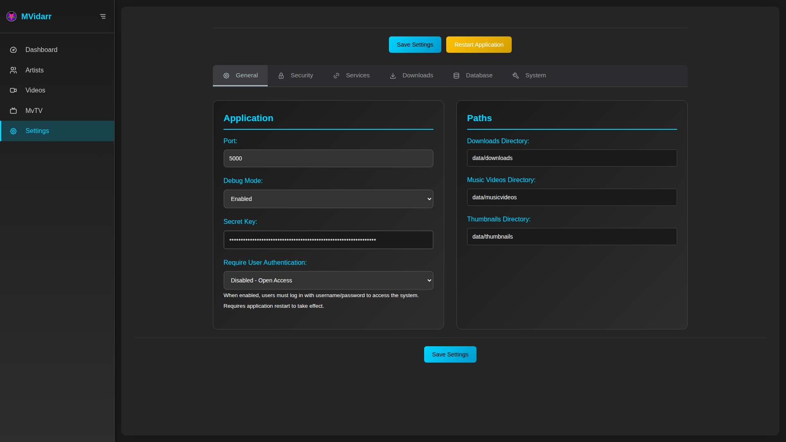

# 🐳 MVidarr - Docker Deployment Guide


*Professional Docker deployment for MVidarr - Production ready in minutes*

## 🚀 Quick Start (30 Seconds)

### One-Command Deployment
```bash
# Clone, configure, and deploy in one go
git clone <repository-url> && cd mvidarr && \
cp docker-config.yml.sample docker-config.yml && \
mkdir -p ~/musicvideos ~/mvidarr-data && \
sudo chown -R 1001:1001 ~/musicvideos ~/mvidarr-data && \
docker-compose --env-file docker-config.yml -f docker-compose.production.yml up -d
```


*One command deployment - your system will be ready in under a minute*

### Manual Step-by-Step


1. **📥 Get the Code**
   ```bash
   git clone <repository-url>
   cd mvidarr
   ```

2. **⚙️ Configure**
   ```bash
   cp docker-config.yml.sample docker-config.yml
   nano docker-config.yml  # Edit your paths and API keys
   ```

3. **📁 Create Storage**
   ```bash
   mkdir -p /path/to/your/{musicvideos,database,thumbnails}
   sudo chown -R 1001:1001 /path/to/your/storage/
   ```

4. **🚀 Deploy**
   ```bash
   docker-compose --env-file docker-config.yml -f docker-compose.production.yml up -d
   ```

5. **🎉 Access**
   - **Web Interface**: http://localhost:5000
   - **Setup Wizard**: Follow the initial setup prompts


*Successful deployment - MVidarr ready for use*

## 📋 Configuration Guide

### docker-config.yml Configuration

*Visual guide to configuring your Docker deployment*

Your main configuration file contains these critical sections:

#### 🗄️ **Storage Configuration**

```yaml
# Primary storage directories (REQUIRED)
MUSIC_VIDEOS_PATH=/home/youruser/musicvideos     # Downloaded videos
DATABASE_FOLDER=/home/youruser/mvidarr/database  # Database files
THUMBNAILS_PATH=/home/youruser/mvidarr/thumbnails # Image cache
```

#### 🔐 **Security Settings**

```yaml
# Database passwords (CHANGE THESE!)
DB_PASSWORD=your_very_secure_password
MYSQL_ROOT_PASSWORD=your_root_password

# Application security
SECRET_KEY=your_long_random_secret_key_here
```

#### 🔑 **API Keys**

```yaml
# External service integration
IMVDB_API_KEY=your_imvdb_api_key      # Get from imvdb.com/developers/api
YOUTUBE_API_KEY=your_youtube_api_key   # Get from console.developers.google.com
```

### docker-compose.production.yml
Production Docker Compose file with:
- **MVidarr**: Main application container
- **MariaDB 11.4**: Database server
- **Volume mounts**: Persistent storage for your data
- **Health checks**: Automatic service monitoring
- **Network isolation**: Secure container networking

## Storage Configuration

### Recommended Directory Structure
```
/your/storage/path/
├── musicvideos/          # Downloaded music videos (MUSIC_VIDEOS_PATH)
├── database/             # MariaDB data files (DATABASE_FOLDER)
├── thumbnails/           # Video and artist thumbnails (THUMBNAILS_PATH)
├── logs/                 # Application logs (LOGS_PATH)
├── cache/                # Application cache (CACHE_PATH)
└── config/               # Configuration files (CONFIG_PATH)
```

### Volume Mount Options
You can choose between:
1. **Host directories**: Map to specific paths on your host system
2. **Named volumes**: Let Docker manage storage locations
3. **Mixed approach**: Use host paths for important data (videos, database) and volumes for cache/logs

## Environment Variables

### Required Settings
- `MUSIC_VIDEOS_PATH`: Where downloaded videos are stored
- `DATABASE_FOLDER`: MariaDB database storage
- `DB_PASSWORD`: Database password (change from default)
- `SECRET_KEY`: Application secret (generate random string)

### API Keys
- `IMVDB_API_KEY`: Get from https://imvdb.com/developers/api
- `YOUTUBE_API_KEY`: Get from https://console.developers.google.com

### Optional Settings
- `MVIDARR_PORT`: Host port for web interface (default: 5000)
- `TZ`: Your timezone (default: UTC)
- `MARIADB_PORT`: Host port for database (default: 3306)

## Management Commands

### Basic Operations
```bash
# Start services
docker-compose --env-file docker-config.yml -f docker-compose.production.yml up -d

# Stop services
docker-compose -f docker-compose.production.yml down

# View logs
docker-compose -f docker-compose.production.yml logs -f mvidarr

# Restart application
docker-compose -f docker-compose.production.yml restart mvidarr
```

### Maintenance Commands
```bash
# Check service health
docker-compose -f docker-compose.production.yml ps

# Access application container
docker-compose -f docker-compose.production.yml exec mvidarr bash

# Database backup
docker-compose -f docker-compose.production.yml exec mariadb mysqldump -u root -p mvidarr_enhanced > backup.sql

# View application logs
docker-compose -f docker-compose.production.yml logs -f --tail=100 mvidarr
```

### Updates
```bash
# Pull latest image
docker-compose -f docker-compose.production.yml pull

# Rebuild and restart
docker-compose --env-file docker-config.yml -f docker-compose.production.yml up -d --build
```

## Troubleshooting

### Common Issues

#### Permission Errors
```bash
# Fix ownership of data directories
sudo chown -R 1001:1001 /path/to/your/data/directories
```

#### Database Connection Errors
- Verify `DB_PASSWORD` matches in docker-config.yml
- Check that MariaDB container is healthy: `docker-compose ps`
- Review database logs: `docker-compose logs mariadb`

#### Application Won't Start
- Check application logs: `docker-compose logs mvidarr`
- Verify all required directories exist and have correct permissions
- Ensure API keys are properly configured

#### Storage Issues
- Verify mounted directories exist on host system
- Check available disk space
- Ensure proper file permissions (user ID 1001)

### Health Checks
The Docker setup includes automated health checks:
- **MVidarr**: Checks `/api/health` endpoint
- **MariaDB**: Verifies database connectivity
- **Network**: Ensures containers can communicate

View health status:
```bash
docker-compose -f docker-compose.production.yml ps
```

### Performance Optimization

#### Resource Limits
Add to docker-compose.production.yml if needed:
```yaml
services:
  mvidarr:
    deploy:
      resources:
        limits:
          memory: 2G
          cpus: '1.0'
```

#### Volume Performance
For better I/O performance:
- Use SSD storage for database
- Keep cache on fast local storage
- Use separate volumes for different data types

## Security Considerations

### Network Security
- The default setup uses internal Docker networking
- Only necessary ports are exposed to the host
- Consider using a reverse proxy for SSL termination

### Data Security
- Change all default passwords
- Use strong, unique SECRET_KEY
- Store docker-config.yml securely
- Regular database backups
- Monitor access logs

### Updates
- Regularly update to latest container versions
- Monitor security advisories
- Test updates in staging environment

## Migration from Existing Installation

### From Local Installation
1. Stop your existing MVidarr service
2. Copy your database: `mysqldump mvidarr_enhanced > mvidarr_backup.sql`
3. Copy your music videos to new storage location
4. Import database to Docker MariaDB
5. Update paths in settings to match container paths

### Database Migration
```bash
# Import existing database
docker-compose -f docker-compose.production.yml exec -T mariadb mysql -u root -p mvidarr_enhanced < mvidarr_backup.sql
```

## Advanced Configuration

### Reverse Proxy (Optional)
Uncomment the nginx section in docker-compose.production.yml for:
- SSL/HTTPS support
- Load balancing
- Advanced routing

### Custom Networks
For integration with existing Docker infrastructure:
```yaml
networks:
  mvidarr-network:
    external: true
    name: your-existing-network
```

### Backup Strategy
Recommended backup approach:
1. **Database**: Regular mysqldump exports
2. **Music Videos**: Sync to external storage
3. **Configuration**: Version control docker-config.yml
4. **Thumbnails**: Include in regular backups

## Support

### Getting Help
- Check container logs first: `docker-compose logs`
- Verify configuration in docker-config.yml
- Ensure all directories exist with correct permissions
- Test database connectivity manually

### Reporting Issues
When reporting issues, include:
- Docker Compose logs
- Container health status
- Your docker-config.yml (remove sensitive data)
- Host system information (OS, Docker version)

### Resources
- **Application Health**: `http://localhost:5000/api/health`
- **Database**: Accessible on port 3306 (if enabled)
- **Documentation**: See `/docs` directory in the repository
- **Configuration**: All settings available in application UI