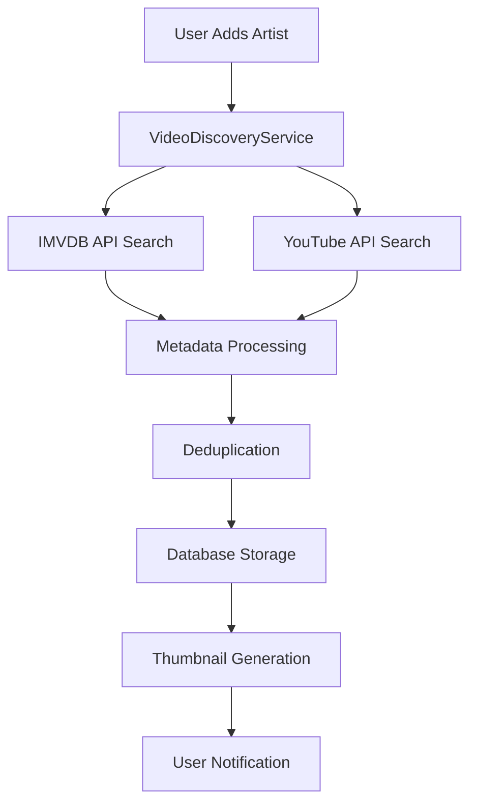
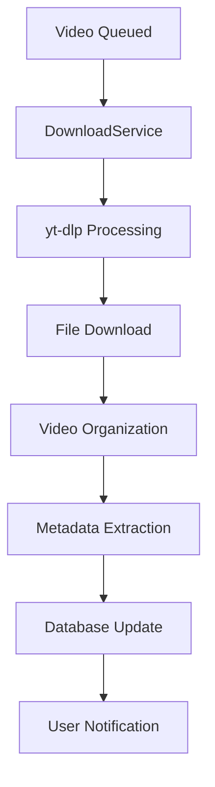

# MVidarr System Architecture

## Overview

MVidarr is a sophisticated music video management system built with a modern Flask-based architecture. The system follows a layered, service-oriented design pattern with clear separation of concerns across presentation, business logic, and data layers. This document provides a comprehensive overview of the system's architecture, component relationships, and design patterns.

## 🏗️ High-Level Architecture

### System Overview
```
┌─────────────────────────────────────────────────────────────┐
│                    External APIs                            │
│  YouTube │ IMVDB │ Spotify │ Last.fm │ Plex │ Lidarr       │
└─────────────────────┬───────────────────────────────────────┘
                      │
┌─────────────────────▼───────────────────────────────────────┐
│                 Service Layer                               │
│  Integration Services │ Core Services │ Utility Services   │
└─────────────────────┬───────────────────────────────────────┘
                      │
┌─────────────────────▼───────────────────────────────────────┐
│                  API Layer                                  │
│        RESTful Endpoints │ Authentication │ Middleware     │
└─────────────────────┬───────────────────────────────────────┘
                      │
┌─────────────────────▼───────────────────────────────────────┐
│               Frontend Layer                                │
│      Templates │ JavaScript │ CSS │ Static Assets          │
└─────────────────────┬───────────────────────────────────────┘
                      │
┌─────────────────────▼───────────────────────────────────────┐
│                Database Layer                               │
│    Models │ Connection Pool │ Migration System             │
└─────────────────────────────────────────────────────────────┘
```

## 🏛️ Application Structure

### Directory Organization
```
mvidarr/
├── app.py                      # Main application entry point
├── src/                        # Core application source
│   ├── api/                    # RESTful API endpoints
│   │   ├── artists.py          # Artist management API
│   │   ├── videos.py           # Video management API  
│   │   ├── settings.py         # Configuration API
│   │   └── [other_apis].py     # Additional API modules
│   ├── config/                 # Configuration management
│   │   └── config.py           # Environment and database config
│   ├── database/               # Database layer
│   │   ├── models.py           # SQLAlchemy models
│   │   └── connection.py       # Connection management
│   ├── middleware/             # Request processing middleware
│   │   └── auth.py             # Authentication middleware
│   ├── services/               # Business logic layer
│   │   ├── artist_service.py   # Artist management
│   │   ├── video_discovery_service.py
│   │   ├── settings_service.py # Configuration service
│   │   └── [external_services] # API integrations
│   └── utils/                  # Utility functions
├── frontend/                   # Frontend assets
│   ├── templates/              # Jinja2 HTML templates
│   ├── static/                 # Static assets (JS, images)
│   └── CSS/                    # Modular stylesheets
└── data/                       # Application data
```

### Main Application Entry Point

**File**: `app.py`
```python
def create_app():
    # Dynamic template and static directory configuration
    template_dir = Path(__file__).parent / "frontend" / "templates"
    static_dir = Path(__file__).parent / "frontend" / "static"
    
    app = Flask(__name__, 
                template_folder=str(template_dir), 
                static_folder=str(static_dir))
    
    # Load configuration from environment and database
    config = Config()
    app.config.from_object(config)
    config.load_from_database()  # Runtime database configuration
    
    # Initialize security, authentication, and services
    configure_security(app)
    register_blueprints(app)
    start_background_services(app)
```

**Key Responsibilities**:
- Flask application initialization
- Dynamic configuration loading
- Security and authentication setup
- Blueprint registration
- Background service initialization

## 🗄️ Database Architecture

### Database Technology Stack
- **ORM**: SQLAlchemy with declarative base models
- **Database**: MySQL/MariaDB (primary), SQLite (development)
- **Connection Management**: Thread-safe connection pooling
- **Migration**: SQLAlchemy migration support

### Connection Pool Configuration
```python
class DatabaseManager:
    def create_engine(self):
        return create_engine(
            connection_url,
            poolclass=QueuePool,
            pool_size=10,           # Base connections
            max_overflow=20,        # Additional connections
            pool_timeout=30,        # Connection timeout
            pool_pre_ping=True,     # Validate connections
            pool_recycle=3600       # Recycle connections hourly
        )
```

### Core Domain Models

#### Artist Model
```python
class Artist(Base):
    __tablename__ = 'artists'
    
    # Core fields
    id = Column(Integer, primary_key=True)
    name = Column(String(255), nullable=False, unique=True)
    folder_path = Column(String(500))
    
    # External service integration
    imvdb_id = Column(Integer, index=True)
    spotify_id = Column(String(255), index=True)
    
    # Metadata and media
    bio = Column(Text)
    thumbnail_url = Column(String(500))
    thumbnail_path = Column(String(500))
    
    # Relationships
    videos = relationship("Video", back_populates="artist")
```

#### Video Model
```python
class Video(Base):
    __tablename__ = 'videos'
    
    # Core identification
    id = Column(Integer, primary_key=True)
    title = Column(String(255), nullable=False)
    artist_id = Column(Integer, ForeignKey('artists.id'), nullable=False)
    
    # Source and metadata
    url = Column(String(500))
    youtube_id = Column(String(50), unique=True, index=True)
    imvdb_id = Column(Integer, unique=True, index=True)
    
    # Status and processing
    status = Column(Enum(VideoStatus), default=VideoStatus.WANTED)
    file_path = Column(String(500))
    thumbnail_path = Column(String(500))
    
    # Relationships
    artist = relationship("Artist", back_populates="videos")
    downloads = relationship("Download", back_populates="video")
```

#### User Model (Authentication)
```python
class User(Base):
    __tablename__ = 'users'
    
    id = Column(Integer, primary_key=True)
    username = Column(String(80), unique=True, nullable=False)
    password_hash = Column(String(255), nullable=False)
    role = Column(Enum(UserRole), default=UserRole.USER)
    
    # Security features
    is_active = Column(Boolean, default=True)
    failed_login_attempts = Column(Integer, default=0)
    locked_until = Column(DateTime)
    two_factor_secret = Column(String(32))
```

### Database Session Management

**Context Manager Pattern**:
```python
@contextmanager
def get_db():
    session = SessionLocal()
    try:
        yield session
        session.commit()
    except Exception:
        session.rollback()
        raise
    finally:
        session.close()

# Usage in services
def create_artist(name):
    with get_db() as session:
        artist = Artist(name=name)
        session.add(artist)
        return artist.id
```

## 🔧 Service Layer Architecture

### Service Design Patterns

#### Core Service Structure
```python
class BaseService:
    def __init__(self):
        self.settings_service = SettingsService()
        self.logger = get_logger(f"mvidarr.{self.__class__.__name__}")
    
    def _handle_api_error(self, response, operation):
        """Standardized error handling across services"""
        if not response.ok:
            self.logger.error(f"{operation} failed: {response.status_code}")
            raise ServiceException(f"{operation} failed")
```

### Core Services

#### Settings Service
**Purpose**: Centralized configuration management with caching
```python
class SettingsService:
    _instance = None
    _cache = {}
    
    @classmethod
    def get(cls, key, default=None):
        # Check cache first
        if key in cls._cache:
            return cls._cache[key]
        
        # Load from database
        with get_db() as session:
            setting = session.query(Setting).filter(Setting.key == key).first()
            value = setting.value if setting else default
            
        # Cache the result
        cls._cache[key] = value
        return value
    
    @classmethod
    def reload_cache(cls):
        """Clear cache to force reload from database"""
        cls._cache.clear()
```

#### Video Discovery Service
**Purpose**: Automated video discovery from external sources
```python
class VideoDiscoveryService:
    def __init__(self):
        self.imvdb_service = imvdb_service
        self.youtube_service = youtube_service
        self.thumbnail_service = thumbnail_service
    
    def discover_videos_for_artist(self, artist_id):
        with get_db() as session:
            artist = session.query(Artist).get(artist_id)
            
            # Search multiple sources
            imvdb_videos = self.imvdb_service.search_artist_videos(artist.name)
            youtube_videos = self.youtube_service.search_videos(f"{artist.name} music video")
            
            # Process and deduplicate
            new_videos = self._process_discovered_videos(
                artist, imvdb_videos + youtube_videos
            )
            
            return new_videos
```

### External Service Integration

#### Common Integration Pattern
```python
class ExternalServiceBase:
    def __init__(self, service_name):
        self.service_name = service_name
        self.api_key = SettingsService.get(f"{service_name}_api_key")
        self.rate_limit_delay = 1.0
        self.session = requests.Session()
    
    def _rate_limited_request(self, url, **kwargs):
        """Rate-limited API request with error handling"""
        time.sleep(self.rate_limit_delay)
        
        try:
            response = self.session.get(url, timeout=30, **kwargs)
            response.raise_for_status()
            return response.json()
        except requests.exceptions.RequestException as e:
            logger.error(f"{self.service_name} API error: {e}")
            raise ServiceException(f"{self.service_name} API unavailable")
```

#### Service Dependencies
```
VideoDiscoveryService
├── IMVDBService          # Video metadata and artist info
├── YouTubeService        # Video search and metadata  
├── ThumbnailService      # Image processing
└── SettingsService       # Configuration

ArtistService
├── VideoDiscoveryService # Find new videos
├── ThumbnailService      # Artist images
└── DatabaseConnection    # Data persistence

SchedulerService
├── VideoDiscoveryService # Scheduled discovery
├── DownloadService       # Scheduled downloads
└── SettingsService       # Schedule configuration
```

## 🌐 API Layer Architecture

### Blueprint Organization

#### Main API Structure
```python
# Main API registration
api_bp = Blueprint('api', __name__, url_prefix='/api')

# Core resource blueprints
api_bp.register_blueprint(artists_bp)    # /api/artists
api_bp.register_blueprint(videos_bp)     # /api/videos
api_bp.register_blueprint(settings_bp)   # /api/settings

# External integration blueprints  
api_bp.register_blueprint(spotify_bp)    # /api/spotify
api_bp.register_blueprint(youtube_bp)    # /api/youtube
api_bp.register_blueprint(imvdb_bp)      # /api/imvdb
```

### RESTful Endpoint Patterns

#### Artists API Blueprint
```python
@artists_bp.route("/", methods=["GET"])
def list_artists():
    """GET /api/artists - List artists with filtering"""
    
@artists_bp.route("/", methods=["POST"]) 
def create_artist():
    """POST /api/artists - Create new artist"""
    
@artists_bp.route("/<int:artist_id>", methods=["GET"])
def get_artist(artist_id):
    """GET /api/artists/{id} - Get artist details"""
    
@artists_bp.route("/<int:artist_id>/videos", methods=["GET"])
def get_artist_videos(artist_id):
    """GET /api/artists/{id}/videos - Get artist's videos"""
    
@artists_bp.route("/<int:artist_id>/discover", methods=["POST"])
def discover_artist_videos(artist_id):
    """POST /api/artists/{id}/discover - Trigger video discovery"""
```

### Authentication Middleware

#### Dynamic Authentication System
```python
class DynamicAuthMiddleware:
    def __init__(self, app):
        self.app = app
        app.before_request(self.check_authentication)
    
    def check_authentication(self):
        # Skip auth for static files and health checks
        if request.endpoint in ['static', 'health']:
            return
        
        # Check if authentication is required (database setting)
        auth_required = SettingsService.get_bool("require_authentication", False)
        
        if auth_required:
            if not session.get("authenticated"):
                if request.path.startswith('/api/'):
                    return jsonify({"error": "Authentication required"}), 401
                else:
                    return redirect("/simple-login")
```

#### Role-Based Access Control
```python
def require_role(required_role):
    def decorator(f):
        @wraps(f)
        def decorated_function(*args, **kwargs):
            if not session.get("authenticated"):
                abort(401)
            
            user_role = session.get("user_role", "USER")
            if not has_permission(user_role, required_role):
                abort(403)
                
            return f(*args, **kwargs)
        return decorated_function
    return decorator

# Usage
@artists_bp.route("/bulk-delete", methods=["POST"])
@require_role("ADMIN")
def bulk_delete_artists():
    # Admin-only functionality
```

## 🖥️ Frontend Architecture

### Template System

#### Base Template Structure
```jinja2
<!-- base.html -->
<!DOCTYPE html>
<html>
<head>
    <title>MVidarr</title>
    <!-- Dynamic theme loading -->
    <link rel="stylesheet" href="{{ url_for('static', filename='main.css') }}">
    
</head>
<body>
    <!-- Navigation with authentication state -->
    <nav class="navbar">
        
            <a href="/artists">Artists</a>
            <a href="/videos">Videos</a>
            <a href="/settings">Settings</a>
            <a href="/logout">Logout</a>
        
            <a href="/login">Login</a>
        
    </nav>
    
    <!-- Main content area -->
    <main>
        
    </main>
    
    <!-- Core JavaScript -->
    <script src="{{ url_for('static', filename='main.js') }}"></script>
    <script src="{{ url_for('static', filename='toast.js') }}"></script>
    
</body>
</html>
```

### JavaScript Architecture

#### Modular JavaScript Design
```javascript
// Core API communication
class APIClient {
    static async request(endpoint, options = {}) {
        const response = await fetch(`/api${endpoint}`, {
            headers: {
                'Content-Type': 'application/json',
                ...options.headers
            },
            ...options
        });
        
        if (!response.ok) {
            throw new Error(`API request failed: ${response.status}`);
        }
        
        return response.json();
    }
}

// Settings management
class SettingsManager {
    static async get(key) {
        const data = await APIClient.request(`/settings/${key}`);
        return data.value;
    }
    
    static async set(key, value) {
        await APIClient.request(`/settings/${key}`, {
            method: 'PUT',
            body: JSON.stringify({ value })
        });
        
        // Trigger settings change event
        document.dispatchEvent(new CustomEvent('settingsChanged', { 
            detail: { key, value } 
        }));
    }
}
```

#### Feature-Specific Modules
- **video-management-enhanced.js**: Video list management, bulk operations
- **universal-search.js**: Global search functionality across all content
- **virtualization-engine.js**: Performance optimization for large datasets
- **ui-enhancements.js**: Interactive UI components and animations

### Static Asset Organization

#### CSS Architecture
```
frontend/CSS/
├── main.css                # Base styles and layout
├── themes.css              # Theme variables and customization
├── ui-enhancements.css     # Interactive component styles  
├── videos.css              # Video-specific styling
└── accessibility.css       # Accessibility improvements
```

#### Asset Loading Strategy
```python
# Dynamic CSS loading based on page
@app.route('/artists')
def artists_page():
    return render_template('artists.html', 
                         extra_css=['artists.css'],
                         extra_js=['artist-management.js'])
```

## 🔄 Data Flow Patterns

### Request Processing Flow

#### Frontend Request Flow
```
User Action → JavaScript Event → API Request → Authentication Check → 
Service Layer → Database Query → Response → UI Update → User Feedback
```

#### Background Task Flow
```
Scheduler Trigger → Service Method → External API Calls → 
Data Processing → Database Updates → User Notifications
```

### Video Discovery Data Flow



### Download Processing Flow



## 🔐 Security Architecture

### Authentication Layers

1. **Dynamic Authentication Check**: Database-driven auth requirement
2. **Session Management**: Secure session handling with configurable timeouts
3. **Role-Based Access**: Multi-tier user roles (ADMIN, MANAGER, USER, READONLY)
4. **Two-Factor Authentication**: TOTP-based 2FA support
5. **Account Security**: Login attempt limiting and account locking

### Security Middleware Stack

```python
def configure_security(app):
    # CORS configuration
    CORS(app, origins=allowed_origins, supports_credentials=True)
    
    # Security headers
    @app.after_request
    def set_security_headers(response):
        response.headers['X-Content-Type-Options'] = 'nosniff'
        response.headers['X-Frame-Options'] = 'DENY'
        response.headers['X-XSS-Protection'] = '1; mode=block'
        return response
    
    # Authentication middleware
    DynamicAuthMiddleware(app)
```

## 🚀 Performance Optimizations

### Database Performance
- **Connection Pooling**: Configurable pool size and overflow
- **Query Optimization**: Strategic indexing on frequently queried fields
- **Lazy Loading**: Relationship loading optimizations
- **Connection Recycling**: Hourly connection refresh

### Frontend Performance
- **Asset Optimization**: CSS/JS minification and compression
- **Virtualization**: Large list rendering optimization
- **Caching**: Strategic caching of API responses
- **Image Optimization**: Thumbnail generation and caching

### Background Processing
- **Scheduler Optimization**: Multiple scheduler strategies (standard/enhanced)
- **Rate Limiting**: External API rate limit compliance
- **Batch Processing**: Efficient bulk operations
- **Resource Management**: Memory-efficient processing for large datasets

## 📈 Scalability Considerations

### Horizontal Scaling
- **Stateless Design**: Session data stored in database, not memory
- **Service Isolation**: Services can be deployed independently
- **Database Scaling**: Connection pooling supports multiple application instances

### Vertical Scaling
- **Resource Configuration**: Configurable connection pools and worker counts
- **Memory Management**: Efficient caching with automatic cleanup
- **Processing Optimization**: Background task optimization and resource limits

## 🔧 Design Patterns

### Core Patterns Used

1. **Service Layer Pattern**: Business logic encapsulated in service classes
2. **Repository Pattern**: Database access abstracted through model classes
3. **Factory Pattern**: Service and database session instantiation
4. **Observer Pattern**: Settings changes trigger system reconfiguration
5. **Strategy Pattern**: Multiple authentication strategies
6. **Command Pattern**: Background task execution
7. **Singleton Pattern**: Service instances and configuration management

### Integration Patterns

1. **Adapter Pattern**: External API integration standardization
2. **Facade Pattern**: Simplified interfaces for complex subsystems
3. **Chain of Responsibility**: Request processing middleware
4. **Template Method**: Common processing flows for different content types

## 🔍 Monitoring and Observability

### Performance Monitoring
- **API Performance Tracking**: Response time monitoring for critical endpoints
- **Database Monitoring**: Connection pool usage and query performance
- **Service Health Checks**: Automated health monitoring for all services

### Logging Architecture
```python
class LoggingManager:
    def __init__(self):
        self.logger = self._configure_logger()
    
    def _configure_logger(self):
        level = SettingsService.get("log_level", "INFO")
        max_size = SettingsService.get_int("log_max_size", 10485760)
        backup_count = SettingsService.get_int("log_backup_count", 5)
        
        # Rotating file handler with configurable size and retention
        handler = RotatingFileHandler(
            filename="logs/mvidarr.log",
            maxBytes=max_size,
            backupCount=backup_count
        )
```

## 📚 Architecture Documentation

For additional architectural details, see:

- **Configuration Guide**: `CONFIGURATION_GUIDE.md`
- **API Documentation**: `API_DOCUMENTATION.md` 
- **Database Schema**: Generated via SQLAlchemy models
- **Service Documentation**: Individual service docstrings
- **Performance Monitoring**: `PERFORMANCE_MONITORING.md`

## 🔄 Evolution and Maintenance

### Architecture Evolution
The MVidarr architecture is designed for evolution:
- **Modular Services**: Easy to add new external service integrations
- **API Versioning**: Support for API evolution without breaking changes
- **Database Migrations**: Structured schema evolution
- **Configuration-Driven**: Runtime behavior changes without code deployment

### Code Organization Principles
1. **Separation of Concerns**: Clear boundaries between layers
2. **DRY (Don't Repeat Yourself)**: Common patterns abstracted into base classes
3. **Single Responsibility**: Each service has a focused purpose
4. **Open/Closed Principle**: Open for extension, closed for modification
5. **Dependency Injection**: Services receive dependencies rather than creating them

This architecture provides a solid foundation for music video management while maintaining flexibility for future enhancements and integrations.