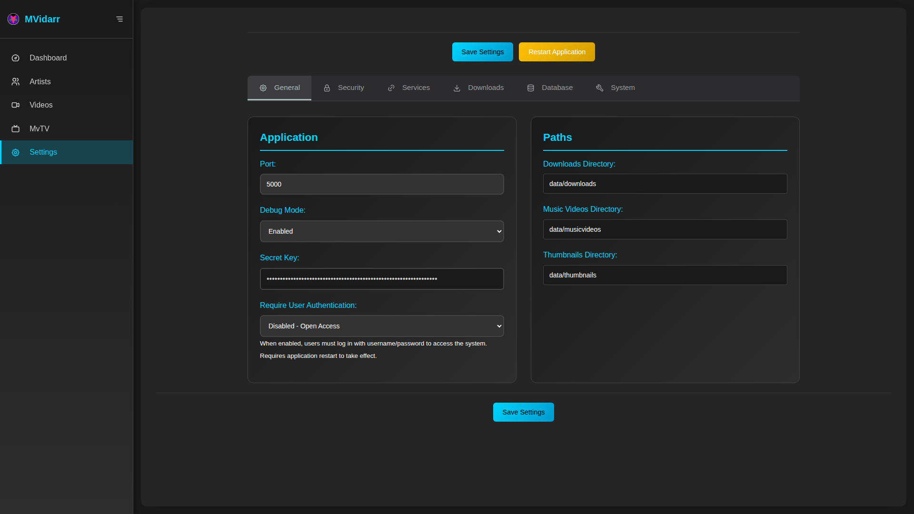

# 🛠️ MVidarr Enhanced - Complete Installation Guide


*Professional installation guide with step-by-step screenshots and troubleshooting*

This comprehensive guide will walk you through installing MVidarr Enhanced using multiple methods, with detailed screenshots and troubleshooting for each step.

---

## 📋 Installation Methods Comparison

| Method | Difficulty | Setup Time | Best For |
|--------|------------|------------|----------|
| 🐳 **Docker** | Easy | 5 minutes | Production, beginners |
| 🔧 **Local** | Moderate | 15 minutes | Development, customization |
| ☁️ **Cloud** | Advanced | 30 minutes | Remote access, scaling |

---

## 🐳 Docker Installation (Recommended)

### Prerequisites Check

*Verify your system meets the requirements before starting*

**System Requirements:**
- **Operating System**: Linux, macOS, or Windows with WSL2
- **Docker**: Version 20.10+ with Docker Compose
- **Memory**: 2GB RAM minimum, 4GB recommended
- **Storage**: 5GB free space minimum, 50GB+ recommended
- **Network**: Internet connection for downloads and API access

**Verify Prerequisites:**
```bash
# Check Docker version
docker --version
# Should show: Docker version 20.10.0 or higher

# Check Docker Compose
docker-compose --version
# Should show: docker-compose version 1.29.0 or higher

# Check available disk space
df -h
# Ensure at least 5GB free in your target directory
```

### Step 1: Download and Setup

*Clone the repository and prepare for configuration*

```bash
# Create installation directory
mkdir -p ~/mvidarr-installation
cd ~/mvidarr-installation

# Clone the repository
git clone <repository-url> .

# Verify files downloaded correctly
ls -la
# You should see: docker-compose.production.yml, docker-config.yml.sample, etc.
```

### Step 2: Configuration

*Configure your deployment with the visual configuration editor*

```bash
# Copy configuration template
cp docker-config.yml.sample docker-config.yml

# Edit configuration (use nano, vim, or your preferred editor)
nano docker-config.yml
```

**Essential Configuration Settings:**


```yaml
# 🗄️ STORAGE PATHS (Customize these for your system)
MUSIC_VIDEOS_PATH=/home/youruser/MusicVideos
DATABASE_FOLDER=/home/youruser/mvidarr-data/database
THUMBNAILS_PATH=/home/youruser/mvidarr-data/thumbnails
LOGS_PATH=/home/youruser/mvidarr-data/logs

# 🔐 SECURITY (CHANGE THESE!)
DB_PASSWORD=your_very_secure_database_password
MYSQL_ROOT_PASSWORD=your_secure_root_password
SECRET_KEY=your_extremely_long_random_secret_key

# 🌐 NETWORKING
MVIDARR_PORT=5000
TZ=America/New_York  # Your timezone

# 🔑 API KEYS (Optional but recommended)
IMVDB_API_KEY=your_imvdb_api_key
YOUTUBE_API_KEY=your_youtube_api_key
```

**Getting API Keys:**


1. **IMVDb API Key:**
   - Visit https://imvdb.com/developers/api
   - Create account and request API access
   - Copy the provided API key

2. **YouTube API Key:**
   - Go to https://console.developers.google.com
   - Create new project or select existing
   - Enable "YouTube Data API v3"
   - Create credentials → API Key
   - Copy the generated key

### Step 3: Storage Directory Setup

*Create and configure storage directories with proper permissions*

```bash
# Create main storage directories
mkdir -p /home/youruser/MusicVideos
mkdir -p /home/youruser/mvidarr-data/{database,thumbnails,logs,cache}

# Set proper ownership (containers run as user 1001)
sudo chown -R 1001:1001 /home/youruser/MusicVideos
sudo chown -R 1001:1001 /home/youruser/mvidarr-data

# Verify permissions
ls -la /home/youruser/
# Should show drwxr-xr-x 1001 1001 for MusicVideos and mvidarr-data directories
```

**Directory Structure Preview:**

```
/home/youruser/
├── MusicVideos/           # Your music video collection
│   ├── Artist 1/
│   ├── Artist 2/
│   └── ...
└── mvidarr-data/          # Application data
    ├── database/          # MariaDB files
    ├── thumbnails/        # Image cache
    ├── logs/             # Application logs
    └── cache/            # Temporary files
```

### Step 4: Deploy Services

*Start all services with Docker Compose*

```bash
# Start all services in background
docker-compose --env-file docker-config.yml -f docker-compose.production.yml up -d

# Monitor startup progress
docker-compose -f docker-compose.production.yml logs -f
# Press Ctrl+C to stop following logs
```

**Deployment Progress:**


You should see output like:
```
Creating network "mvidarr_mvidarr-network" ... done
Creating volume "mvidarr_app_data" ... done
Creating mvidarr-mariadb ... done
Creating mvidarr-enhanced ... done
```

### Step 5: Verify Installation

*Verify all containers are running and healthy*

```bash
# Check container status
docker-compose -f docker-compose.production.yml ps

# Expected output:
#     Name                   Command               State           Ports         
# mvidarr-enhanced    python app.py                Up      0.0.0.0:5000->5000/tcp
# mvidarr-mariadb     docker-entrypoint.sh mysqld  Up      0.0.0.0:3306->3306/tcp

# Test web interface
curl -f http://localhost:5000/api/health
# Should return: {"status": "healthy", ...}
```

### Step 6: Initial Access

*Access your new MVidarr Enhanced installation*

1. **Open Web Browser**
   - Navigate to: http://localhost:5000
   - You should see the MVidarr Enhanced welcome screen

2. **Complete Setup Wizard**
   
   - Configure API keys (if not done in docker-config.yml)
   - Set up download preferences
   - Create your first artist

3. **Verify Everything Works**
   - Add a test artist
   - Run video discovery
   - Check system health dashboard

---

## 🔧 Local Installation

### Prerequisites Check

*Comprehensive system requirements verification*

**System Requirements:**
- **Operating System**: Ubuntu 20.04+, CentOS 8+, macOS 11+, Windows 10+ (WSL2)
- **Python**: Version 3.12 or higher
- **Database**: MariaDB 11.4+ or MySQL 8.0+
- **Memory**: 2GB RAM minimum, 4GB recommended
- **Storage**: 10GB free space minimum

**System-Specific Prerequisites:**

#### Ubuntu/Debian

```bash
# Update package list
sudo apt update

# Install required packages
sudo apt install -y \
    python3.12 \
    python3.12-venv \
    python3-pip \
    mariadb-server \
    mariadb-client \
    libmariadb-dev \
    pkg-config \
    ffmpeg \
    git \
    curl \
    build-essential

# Verify installations
python3.12 --version  # Should be 3.12+
mysql --version       # Should be MariaDB 11.4+
ffmpeg -version      # Should show FFmpeg information
```

#### CentOS/RHEL

```bash
# Enable EPEL repository
sudo yum install -y epel-release

# Install required packages
sudo yum install -y \
    python39 \
    python39-pip \
    python39-devel \
    mariadb-server \
    mariadb-devel \
    gcc \
    gcc-c++ \
    ffmpeg \
    git \
    curl

# Start and enable MariaDB
sudo systemctl start mariadb
sudo systemctl enable mariadb
```

#### macOS

```bash
# Install Homebrew (if not already installed)
/bin/bash -c "$(curl -fsSL https://raw.githubusercontent.com/Homebrew/install/HEAD/install.sh)"

# Install required packages
brew install python@3.12 mariadb ffmpeg git

# Start MariaDB service
brew services start mariadb
```

### Step 1: Database Setup

*Configure MariaDB database for MVidarr Enhanced*

```bash
# Secure MariaDB installation
sudo mysql_secure_installation

# Follow prompts:
# - Set root password: YES (choose strong password)
# - Remove anonymous users: YES
# - Disallow root login remotely: YES
# - Remove test database: YES
# - Reload privilege tables: YES
```

**Create MVidarr Database:**

```bash
# Connect to MariaDB as root
sudo mysql -u root -p

# Create database and user
CREATE DATABASE mvidarr_enhanced 
    CHARACTER SET utf8mb4 
    COLLATE utf8mb4_unicode_ci;

CREATE USER 'mvidarr'@'localhost' 
    IDENTIFIED BY 'your_secure_password';

GRANT ALL PRIVILEGES ON mvidarr_enhanced.* 
    TO 'mvidarr'@'localhost';

FLUSH PRIVILEGES;

# Test the new user
EXIT;
mysql -u mvidarr -p mvidarr_enhanced
# Should connect successfully
EXIT;
```

### Step 2: Application Download and Setup

*Download and configure the MVidarr Enhanced application*

```bash
# Create installation directory
mkdir -p ~/mvidarr-enhanced
cd ~/mvidarr-enhanced

# Clone repository
git clone <repository-url> .

# Create Python virtual environment
python3.12 -m venv venv

# Activate virtual environment
source venv/bin/activate
# Your prompt should now show (venv)

# Upgrade pip
pip install --upgrade pip

# Install Python dependencies
pip install -r requirements.txt
```

**Installation Progress:**

*Monitor the dependency installation process*

### Step 3: Configuration

*Configure application settings and environment*

```bash
# Copy environment template
cp .env.example .env

# Edit configuration
nano .env
```

**Environment Configuration:**

```bash
# Database configuration
DB_HOST=localhost
DB_PORT=3306
DB_NAME=mvidarr_enhanced
DB_USER=mvidarr
DB_PASSWORD=your_secure_password

# Application settings
SECRET_KEY=your_very_long_random_secret_key
PORT=5000
HOST=0.0.0.0
DEBUG=false

# Storage paths
MUSIC_VIDEOS_PATH=/home/youruser/MusicVideos
THUMBNAILS_PATH=/home/youruser/mvidarr-data/thumbnails
LOGS_PATH=/home/youruser/mvidarr-data/logs

# API keys (optional)
IMVDB_API_KEY=your_imvdb_api_key
YOUTUBE_API_KEY=your_youtube_api_key

# Timezone
TZ=America/New_York
```

### Step 4: Initialize Database

*Initialize the database schema and tables*

```bash
# Ensure virtual environment is active
source venv/bin/activate

# Initialize database
python -c "
from src.database.connection import DatabaseManager
from src.database.models import *
import os
os.environ['DB_HOST'] = 'localhost'
os.environ['DB_NAME'] = 'mvidarr_enhanced'
os.environ['DB_USER'] = 'mvidarr'
os.environ['DB_PASSWORD'] = 'your_secure_password'
db = DatabaseManager()
db.create_all_tables()
print('Database initialized successfully!')
"
```

### Step 5: Create Storage Directories

*Set up data storage directories with proper permissions*

```bash
# Create storage directories
mkdir -p ~/MusicVideos
mkdir -p ~/mvidarr-data/{thumbnails,logs,cache}

# Set permissions
chmod 755 ~/MusicVideos
chmod 755 ~/mvidarr-data
chmod -R 755 ~/mvidarr-data/

# Verify directory creation
ls -la ~/
ls -la ~/mvidarr-data/
```

### Step 6: Start Application

*Launch MVidarr Enhanced application*

```bash
# Ensure virtual environment is active
source venv/bin/activate

# Start application
python app.py

# You should see output like:
# * Running on http://0.0.0.0:5000
# * Debug mode: off
# * Application started successfully
```

**Service Management Script:**

```bash
# Make service script executable
chmod +x scripts/manage_service.sh

# Use service script for management
./scripts/manage_service.sh start    # Start application
./scripts/manage_service.sh stop     # Stop application
./scripts/manage_service.sh restart  # Restart application
./scripts/manage_service.sh status   # Check status
./scripts/manage_service.sh logs     # View logs
```

### Step 7: Initial Setup

*Complete the initial configuration through web interface*

1. **Access Web Interface**
   - Open browser to: http://localhost:5000
   - You should see the MVidarr Enhanced welcome screen

2. **Configure API Keys**
   
   - Go to Settings → External Services
   - Add your IMVDb and YouTube API keys
   - Test connections to verify functionality

3. **Set Storage Paths**
   
   - Go to Settings → Downloads
   - Verify paths match your directory setup
   - Test write permissions

---

## ☁️ Cloud Installation

### AWS EC2 Deployment

*Deploy MVidarr Enhanced on Amazon Web Services*

**EC2 Instance Requirements:**
- **Instance Type**: t3.medium or larger (2 vCPU, 4GB RAM)
- **Storage**: 20GB+ EBS volume for system, additional volume for videos
- **Security Group**: Allow HTTP (80), HTTPS (443), SSH (22)
- **Operating System**: Ubuntu 22.04 LTS

**Deployment Steps:**
```bash
# Connect to your EC2 instance
ssh -i your-key.pem ubuntu@your-instance-ip

# Update system
sudo apt update && sudo apt upgrade -y

# Install Docker
curl -fsSL https://get.docker.com -o get-docker.sh
sudo sh get-docker.sh
sudo usermod -aG docker ubuntu

# Install Docker Compose
sudo curl -L "https://github.com/docker/compose/releases/download/v2.21.0/docker-compose-$(uname -s)-$(uname -m)" -o /usr/local/bin/docker-compose
sudo chmod +x /usr/local/bin/docker-compose

# Clone and deploy MVidarr Enhanced
git clone <repository-url> mvidarr
cd mvidarr
# Follow Docker installation steps from above
```

### DigitalOcean Droplet

*Simple deployment on DigitalOcean*

**Droplet Specifications:**
- **Size**: 2GB RAM, 2 vCPUs, 50GB SSD
- **Region**: Choose closest to your location
- **Image**: Ubuntu 22.04 LTS with Docker pre-installed
- **Firewall**: Allow HTTP, HTTPS, SSH

### Google Cloud Platform

*Deploy on Google Cloud Platform with managed services*

**Compute Engine Setup:**
- **Machine Type**: e2-standard-2 (2 vCPU, 8GB RAM)
- **Boot Disk**: Ubuntu 22.04 LTS, 20GB
- **Additional Disk**: 100GB+ for video storage
- **Firewall**: Allow HTTP and HTTPS traffic

---

## 🔧 Post-Installation Configuration

### Initial System Health Check

*Verify all components are working correctly*

**Health Check Steps:**
1. **Web Interface Access**
   - Navigate to your installation URL
   - Verify welcome screen appears
   - Check for any error messages

2. **Database Connectivity**
   - Go to Settings → System Health
   - Verify database shows "Connected"
   - Check database response times

3. **API Connectivity**
   - Test IMVDb API connection
   - Test YouTube API connection
   - Verify rate limits are properly configured

4. **Storage Access**
   - Check download directory permissions
   - Verify thumbnail cache is writable
   - Test log file creation

### Security Hardening

*Secure your MVidarr Enhanced installation*

**Security Checklist:**
- ✅ Change all default passwords
- ✅ Use strong, unique SECRET_KEY
- ✅ Configure firewall rules
- ✅ Enable automatic updates
- ✅ Set up backup procedures
- ✅ Configure SSL/HTTPS (for public access)
- ✅ Regular security updates

### Backup Configuration

*Set up automated backups for your data*

**Backup Strategy:**
1. **Database Backups**
   ```bash
   # Daily database backup script
   #!/bin/bash
   BACKUP_DIR="/path/to/backups"
   DATE=$(date +%Y%m%d_%H%M%S)
   
   # Docker environment
   docker exec mvidarr-mariadb mysqldump -u root -p$MYSQL_ROOT_PASSWORD mvidarr_enhanced > "$BACKUP_DIR/db_backup_$DATE.sql"
   
   # Local environment
   mysqldump -u mvidarr -p mvidarr_enhanced > "$BACKUP_DIR/db_backup_$DATE.sql"
   ```

2. **File Backups**
   - Music video collection
   - Thumbnail cache
   - Configuration files
   - Application logs

---

## 🚨 Troubleshooting

### Common Installation Issues

#### Docker Issues


**Container Won't Start:**
```bash
# Check container logs
docker-compose logs mvidarr

# Common issues and solutions:
# 1. Permission denied on data directories
sudo chown -R 1001:1001 /path/to/your/data

# 2. Port already in use
# Change MVIDARR_PORT in docker-config.yml

# 3. Database connection failed
# Verify database passwords in docker-config.yml
```

**Image Build Failures:**
```bash
# Clean Docker cache
docker system prune -a

# Rebuild images
docker-compose build --no-cache

# Check available disk space
df -h
```

#### Local Installation Issues


**Python Dependencies:**
```bash
# Common pip installation issues
pip install --upgrade pip setuptools wheel

# If MariaDB client fails to install:
sudo apt install libmariadb-dev-compat

# Virtual environment issues:
deactivate
rm -rf venv
python3.12 -m venv venv
source venv/bin/activate
```

**Database Connection Issues:**
```bash
# Test database connection manually
mysql -u mvidarr -p -h localhost mvidarr_enhanced

# Check MariaDB service status
sudo systemctl status mariadb

# Restart MariaDB service
sudo systemctl restart mariadb
```

### Performance Optimization

*Optimize your installation for best performance*

**For Large Video Collections:**
1. **Database Tuning**
   ```sql
   # Increase buffer pool size
   SET GLOBAL innodb_buffer_pool_size = 1073741824; -- 1GB
   
   # Optimize query cache
   SET GLOBAL query_cache_size = 67108864; -- 64MB
   ```

2. **System Resources**
   - Increase available RAM
   - Use SSD storage for database
   - Optimize network settings

3. **Application Settings**
   - Adjust concurrent download limits
   - Configure thumbnail cache size
   - Enable database query caching

---

## ✅ Installation Verification Checklist

### Basic Functionality


- [ ] **Web interface accessible** at configured URL
- [ ] **Database connection successful** (green status in health check)
- [ ] **API keys configured** and tested
- [ ] **Storage directories** created with proper permissions
- [ ] **Service starts automatically** on system boot
- [ ] **Logs are being written** to configured location

### Advanced Features
- [ ] **Add test artist** successfully
- [ ] **Video discovery** finds results
- [ ] **Download test video** completes successfully
- [ ] **Thumbnail generation** works
- [ ] **Video streaming** plays without errors
- [ ] **Search functionality** returns results

### Security Verification
- [ ] **Default passwords changed**
- [ ] **Firewall configured** (if applicable)
- [ ] **SSL/HTTPS enabled** (for public access)
- [ ] **Backup system** configured and tested
- [ ] **Update mechanism** working

---

## 🎉 Installation Complete!

Congratulations! You've successfully installed MVidarr Enhanced. Here are your next steps:

### Immediate Actions
1. **🎯 Add Your First Artist**
   - Navigate to Artists → Add Artist
   - Search for a favorite artist
   - Configure monitoring preferences

2. **⚙️ Configure Preferences**
   - Set video quality preferences
   - Configure download schedules
   - Set up organizational structure

3. **🔐 Secure Your Installation**
   - Change default passwords
   - Configure API keys
   - Set up backups

### Ongoing Maintenance
- **📊 Monitor System Health** regularly
- **🔄 Keep Software Updated**
- **💾 Maintain Regular Backups**
- **📈 Monitor Storage Usage**

### Getting Help
- **📖 User Guide**: Complete feature documentation
- **🐛 Issues**: Report bugs on GitHub
- **💬 Community**: Join discussions and get help
- **🔧 Support**: Built-in diagnostics and health checks

---

**🎵 Welcome to MVidarr Enhanced! Enjoy building your music video collection! 🎵**

*For additional help, see the [Complete User Guide](USER-GUIDE.md) or [Docker Quick Start](../DOCKER-QUICKSTART.md).*