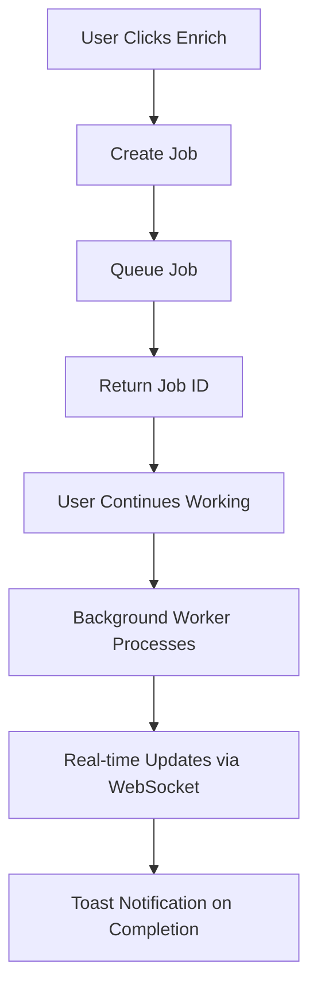

# Background Job Engine for Metadata Enrichment

## Executive Summary

**ARCHITECTURAL PIVOT**: Moving from synchronous request-response enrichment to a **background job queue system** that fundamentally improves user experience, system reliability, and scalability.

## Problem Statement

The current approach treats metadata enrichment as synchronous operations where users must wait 30+ seconds watching "Enriching metadata..." spinners. This causes:

- **Poor User Experience**: Users stuck waiting, can't navigate away
- **Browser Timeouts**: Long-running requests fail
- **Resource Contention**: Multiple simultaneous requests overwhelm APIs
- **System Reliability Issues**: AsyncIO lock conflicts, session binding errors
- **No Progress Visibility**: Users have no feedback on what's happening

## Solution: Background Job Engine Architecture

### Core Philosophy
**"Fire and Forget with Real-time Feedback"**

Users trigger operations and immediately continue working while the system processes jobs in the background and provides real-time updates.



## Phase 1: Core Job Infrastructure (High Priority - 2 weeks)

### 1.1 Job Queue Foundation
**File: `src/services/job_queue.py`**

```python
from enum import Enum
from dataclasses import dataclass, field
from datetime import datetime, timedelta
from typing import Dict, Any, Optional, List
import uuid
import asyncio
import json

class JobType(Enum):
    METADATA_ENRICHMENT = "metadata_enrichment"
    VIDEO_DOWNLOAD = "video_download"
    BULK_ARTIST_IMPORT = "bulk_artist_import"
    THUMBNAIL_GENERATION = "thumbnail_generation"
    PLAYLIST_SYNC = "playlist_sync"

class JobStatus(Enum):
    QUEUED = "queued"
    PROCESSING = "processing"
    COMPLETED = "completed"
    FAILED = "failed"
    RETRYING = "retrying"
    CANCELLED = "cancelled"

class JobPriority(Enum):
    LOW = 1
    NORMAL = 2
    HIGH = 3
    URGENT = 4

@dataclass
class BackgroundJob:
    id: str = field(default_factory=lambda: str(uuid.uuid4()))
    type: JobType
    status: JobStatus = JobStatus.QUEUED
    priority: JobPriority = JobPriority.NORMAL
    payload: Dict[str, Any] = field(default_factory=dict)
    progress: int = 0  # 0-100
    message: str = ""
    error_message: Optional[str] = None
    
    # Timing
    created_at: datetime = field(default_factory=datetime.utcnow)
    started_at: Optional[datetime] = None
    completed_at: Optional[datetime] = None
    
    # Retry Logic
    retry_count: int = 0
    max_retries: int = 3
    retry_delay: int = 60  # seconds
    
    # Metadata
    created_by: Optional[str] = None
    tags: Dict[str, Any] = field(default_factory=dict)

class JobQueue:
    def __init__(self):
        self._jobs: Dict[str, BackgroundJob] = {}
        self._queue: asyncio.PriorityQueue = asyncio.PriorityQueue()
        self._subscribers: Dict[str, List[callable]] = {}
    
    async def enqueue(self, job: BackgroundJob) -> str:
        """Add job to queue and return job ID"""
        self._jobs[job.id] = job
        await self._queue.put((job.priority.value, job.created_at, job))
        await self._notify_subscribers(job.id, "job_queued")
        return job.id
    
    async def get_next_job(self) -> Optional[BackgroundJob]:
        """Get next job from queue (blocks if empty)"""
        try:
            priority, created_at, job = await asyncio.wait_for(
                self._queue.get(), timeout=1.0
            )
            job.status = JobStatus.PROCESSING
            job.started_at = datetime.utcnow()
            await self._notify_subscribers(job.id, "job_started")
            return job
        except asyncio.TimeoutError:
            return None
    
    async def update_progress(self, job_id: str, progress: int, message: str = ""):
        """Update job progress and notify subscribers"""
        if job_id in self._jobs:
            job = self._jobs[job_id]
            job.progress = progress
            job.message = message
            await self._notify_subscribers(job_id, "job_progress")
    
    async def complete_job(self, job_id: str, result: Any = None):
        """Mark job as completed"""
        if job_id in self._jobs:
            job = self._jobs[job_id]
            job.status = JobStatus.COMPLETED
            job.completed_at = datetime.utcnow()
            job.progress = 100
            job.message = "Completed successfully"
            await self._notify_subscribers(job_id, "job_completed")
    
    async def fail_job(self, job_id: str, error: str, retry: bool = True):
        """Mark job as failed and optionally retry"""
        if job_id in self._jobs:
            job = self._jobs[job_id]
            job.error_message = error
            
            if retry and job.retry_count < job.max_retries:
                job.status = JobStatus.RETRYING
                job.retry_count += 1
                # Re-queue with delay
                await asyncio.sleep(job.retry_delay * job.retry_count)
                await self.enqueue(job)
                await self._notify_subscribers(job_id, "job_retrying")
            else:
                job.status = JobStatus.FAILED
                job.completed_at = datetime.utcnow()
                await self._notify_subscribers(job_id, "job_failed")
```

### 1.2 Background Worker Engine
**File: `src/services/background_workers.py`**

```python
import asyncio
import logging
from typing import Dict, Type
from .job_queue import JobQueue, JobType, BackgroundJob
from .enrichment_worker import MetadataEnrichmentWorker
from .download_worker import VideoDownloadWorker

logger = logging.getLogger(__name__)

class BackgroundWorkerManager:
    def __init__(self, job_queue: JobQueue):
        self.job_queue = job_queue
        self.workers: Dict[JobType, Type] = {
            JobType.METADATA_ENRICHMENT: MetadataEnrichmentWorker,
            JobType.VIDEO_DOWNLOAD: VideoDownloadWorker,
            # Add more worker types here
        }
        self.running = False
        self.worker_tasks = []
    
    async def start(self, num_workers: int = 3):
        """Start background worker pool"""
        self.running = True
        logger.info(f"Starting {num_workers} background workers...")
        
        for i in range(num_workers):
            task = asyncio.create_task(self._worker_loop(f"worker-{i}"))
            self.worker_tasks.append(task)
    
    async def stop(self):
        """Stop all background workers gracefully"""
        self.running = False
        logger.info("Stopping background workers...")
        
        for task in self.worker_tasks:
            task.cancel()
        
        await asyncio.gather(*self.worker_tasks, return_exceptions=True)
        self.worker_tasks.clear()
    
    async def _worker_loop(self, worker_name: str):
        """Main worker loop - processes jobs from queue"""
        logger.info(f"{worker_name} started")
        
        while self.running:
            try:
                job = await self.job_queue.get_next_job()
                if not job:
                    continue
                
                logger.info(f"{worker_name} processing job {job.id} ({job.type.value})")
                
                # Get appropriate worker class
                worker_class = self.workers.get(job.type)
                if not worker_class:
                    await self.job_queue.fail_job(
                        job.id, f"No worker available for job type {job.type.value}"
                    )
                    continue
                
                # Process job
                worker = worker_class(self.job_queue, job)
                await worker.process()
                
            except asyncio.CancelledError:
                logger.info(f"{worker_name} cancelled")
                break
            except Exception as e:
                logger.error(f"{worker_name} error: {e}")
                if 'job' in locals():
                    await self.job_queue.fail_job(job.id, str(e))

# Global worker manager instance
_worker_manager: Optional[BackgroundWorkerManager] = None

async def get_worker_manager() -> BackgroundWorkerManager:
    """Get global worker manager instance"""
    global _worker_manager
    if not _worker_manager:
        from .job_queue import get_job_queue
        job_queue = await get_job_queue()
        _worker_manager = BackgroundWorkerManager(job_queue)
    return _worker_manager
```

### 1.3 Metadata Enrichment Worker
**File: `src/services/enrichment_worker.py`**

```python
import asyncio
import logging
from typing import Dict, Any
from .background_worker_base import BaseWorker
from .async_spotify_service import get_async_spotify_service
from .lastfm_service import lastfm_service
from .musicbrainz_service import musicbrainz_service
from src.database.models import Artist
from src.database.connection import get_db

logger = logging.getLogger(__name__)

class MetadataEnrichmentWorker(BaseWorker):
    """Worker for metadata enrichment jobs"""
    
    async def process(self):
        """Process metadata enrichment job"""
        try:
            # Extract job payload
            artist_id = self.job.payload.get('artist_id')
            force_refresh = self.job.payload.get('force_refresh', False)
            
            if not artist_id:
                raise ValueError("Missing artist_id in job payload")
            
            # Get artist from database
            with get_db() as session:
                artist = session.query(Artist).filter(Artist.id == artist_id).first()
                if not artist:
                    raise ValueError(f"Artist {artist_id} not found")
                
                artist_name = artist.name
                spotify_id = artist.spotify_id
            
            # Update progress
            await self.update_progress(10, f"Starting enrichment for {artist_name}")
            
            # Process each service with proper error handling and progress updates
            metadata_sources = {}
            
            # Spotify enrichment (25% of progress)
            try:
                await self.update_progress(25, "Getting Spotify metadata...")
                spotify_service = await get_async_spotify_service()
                
                spotify_metadata = await self._get_spotify_metadata({
                    'name': artist_name,
                    'id': artist_id,
                    'spotify_id': spotify_id
                }, spotify_service)
                
                if spotify_metadata:
                    metadata_sources['spotify'] = spotify_metadata
                    logger.info(f"✅ Spotify metadata retrieved for {artist_name}")
                else:
                    logger.warning(f"❌ No Spotify metadata for {artist_name}")
                    
            except Exception as e:
                logger.error(f"Spotify enrichment failed for {artist_name}: {e}")
                # Continue with other services
            
            # Last.fm enrichment (50% of progress)
            try:
                await self.update_progress(50, "Getting Last.fm metadata...")
                
                lastfm_metadata = await self._get_lastfm_metadata({
                    'name': artist_name,
                    'lastfm_name': getattr(artist, 'lastfm_name', None) or artist_name
                })
                
                if lastfm_metadata:
                    metadata_sources['lastfm'] = lastfm_metadata
                    logger.info(f"✅ Last.fm metadata retrieved for {artist_name}")
                    
            except Exception as e:
                logger.error(f"Last.fm enrichment failed for {artist_name}: {e}")
            
            # MusicBrainz enrichment (75% of progress)
            try:
                await self.update_progress(75, "Getting MusicBrainz metadata...")
                
                # Add MusicBrainz logic here when converted to async
                logger.info(f"⏭️  MusicBrainz skipped for {artist_name} (not yet async)")
                
            except Exception as e:
                logger.error(f"MusicBrainz enrichment failed for {artist_name}: {e}")
            
            # Final database update (90% of progress)
            await self.update_progress(90, "Updating database...")
            
            if metadata_sources:
                # Merge metadata and update artist
                merged_metadata = self._merge_metadata_sources(metadata_sources)
                
                with get_db() as session:
                    artist = session.query(Artist).filter(Artist.id == artist_id).first()
                    if artist:
                        # Update artist with merged metadata
                        self._update_artist_with_metadata(artist, merged_metadata, session)
                        session.commit()
                        
                        logger.info(f"✅ Database updated for {artist_name}")
                        await self.complete(f"Successfully enriched {artist_name} from {len(metadata_sources)} sources")
                    else:
                        raise ValueError(f"Artist {artist_id} disappeared during processing")
            else:
                # No metadata found from any source
                await self.complete(f"No metadata found for {artist_name} from any source")
                
        except Exception as e:
            logger.error(f"Metadata enrichment job {self.job.id} failed: {e}")
            await self.fail(str(e))
    
    async def _get_spotify_metadata(self, artist_data: Dict, spotify_service) -> Dict[str, Any]:
        """Get Spotify metadata with proper async handling"""
        # Implementation using existing async Spotify service
        pass
    
    async def _get_lastfm_metadata(self, artist_data: Dict) -> Dict[str, Any]:
        """Get Last.fm metadata (will be async when service is converted)"""
        # Temporary: call existing sync service in thread pool
        loop = asyncio.get_event_loop()
        return await loop.run_in_executor(
            None, 
            self._sync_lastfm_call, 
            artist_data
        )
    
    def _sync_lastfm_call(self, artist_data: Dict) -> Dict[str, Any]:
        """Temporary wrapper for sync Last.fm calls"""
        # Use existing Last.fm service
        return {}  # Implement based on existing service
    
    def _merge_metadata_sources(self, sources: Dict[str, Any]) -> Dict[str, Any]:
        """Merge metadata from multiple sources with priority"""
        merged = {}
        
        # Priority order: Spotify > Last.fm > MusicBrainz > Others
        priority_order = ['spotify', 'lastfm', 'musicbrainz']
        
        for source_name in priority_order:
            if source_name in sources:
                source_data = sources[source_name]
                # Merge logic here - implement based on existing metadata enrichment
                merged.update(source_data)
        
        return merged
    
    def _update_artist_with_metadata(self, artist: Artist, metadata: Dict[str, Any], session):
        """Update artist with merged metadata"""
        # Implementation based on existing metadata enrichment logic
        pass
```

### 1.4 Real-time Updates System
**File: `src/api/websockets.py`**

```python
from flask_socketio import SocketIO, emit, join_room, leave_room
from flask import request
import logging

logger = logging.getLogger(__name__)

socketio = SocketIO(cors_allowed_origins="*", async_mode='threading')

class JobNotificationService:
    def __init__(self, socketio_instance):
        self.socketio = socketio_instance
        self.job_subscribers = {}  # job_id -> [session_ids]
    
    def subscribe_to_job(self, job_id: str, session_id: str):
        """Subscribe a client session to job updates"""
        if job_id not in self.job_subscribers:
            self.job_subscribers[job_id] = []
        
        if session_id not in self.job_subscribers[job_id]:
            self.job_subscribers[job_id].append(session_id)
            join_room(f"job_{job_id}", request.sid)
            logger.info(f"Client {session_id} subscribed to job {job_id}")
    
    def unsubscribe_from_job(self, job_id: str, session_id: str):
        """Unsubscribe a client session from job updates"""
        if job_id in self.job_subscribers:
            if session_id in self.job_subscribers[job_id]:
                self.job_subscribers[job_id].remove(session_id)
                leave_room(f"job_{job_id}", request.sid)
    
    def notify_job_update(self, job_id: str, event_type: str, data: dict):
        """Send job update to all subscribers"""
        room = f"job_{job_id}"
        self.socketio.emit('job_update', {
            'job_id': job_id,
            'event_type': event_type,
            'data': data
        }, room=room)

# Global service instance
job_notification_service = JobNotificationService(socketio)

@socketio.on('subscribe_job')
def handle_job_subscription(data):
    """Handle client subscription to job updates"""
    job_id = data.get('job_id')
    if job_id:
        job_notification_service.subscribe_to_job(job_id, request.sid)
        emit('subscribed', {'job_id': job_id})

@socketio.on('unsubscribe_job') 
def handle_job_unsubscription(data):
    """Handle client unsubscription from job updates"""
    job_id = data.get('job_id')
    if job_id:
        job_notification_service.unsubscribe_from_job(job_id, request.sid)
        emit('unsubscribed', {'job_id': job_id})

@socketio.on('disconnect')
def handle_disconnect():
    """Clean up subscriptions on client disconnect"""
    # Remove session from all job subscriptions
    for job_id, subscribers in job_notification_service.job_subscribers.items():
        if request.sid in subscribers:
            subscribers.remove(request.sid)
```

### 1.5 API Integration
**File: `src/api/jobs.py`**

```python
from flask import Blueprint, jsonify, request
from src.services.job_queue import JobType, JobPriority, BackgroundJob, get_job_queue
from src.api.auth import require_auth
import asyncio

jobs_bp = Blueprint('jobs', __name__)

@jobs_bp.route('/api/jobs/enrich-metadata', methods=['POST'])
@require_auth
async def enqueue_metadata_enrichment():
    """Enqueue metadata enrichment job"""
    try:
        data = request.get_json()
        artist_id = data.get('artist_id')
        force_refresh = data.get('force_refresh', False)
        
        if not artist_id:
            return jsonify({'error': 'artist_id is required'}), 400
        
        # Create job
        job = BackgroundJob(
            type=JobType.METADATA_ENRICHMENT,
            priority=JobPriority.NORMAL,
            payload={
                'artist_id': artist_id,
                'force_refresh': force_refresh
            },
            created_by=request.user_id  # From auth middleware
        )
        
        # Enqueue job
        job_queue = await get_job_queue()
        job_id = await job_queue.enqueue(job)
        
        return jsonify({
            'success': True,
            'job_id': job_id,
            'message': 'Metadata enrichment job queued successfully'
        })
        
    except Exception as e:
        return jsonify({'error': str(e)}), 500

@jobs_bp.route('/api/jobs/<job_id>', methods=['GET'])
@require_auth
async def get_job_status(job_id: str):
    """Get job status and progress"""
    try:
        job_queue = await get_job_queue()
        job = job_queue.get_job(job_id)
        
        if not job:
            return jsonify({'error': 'Job not found'}), 404
        
        return jsonify({
            'job_id': job.id,
            'type': job.type.value,
            'status': job.status.value,
            'progress': job.progress,
            'message': job.message,
            'error_message': job.error_message,
            'created_at': job.created_at.isoformat(),
            'started_at': job.started_at.isoformat() if job.started_at else None,
            'completed_at': job.completed_at.isoformat() if job.completed_at else None
        })
        
    except Exception as e:
        return jsonify({'error': str(e)}), 500

@jobs_bp.route('/api/jobs', methods=['GET'])
@require_auth
async def list_jobs():
    """List recent jobs for current user"""
    try:
        job_queue = await get_job_queue()
        jobs = await job_queue.get_user_jobs(request.user_id, limit=50)
        
        return jsonify({
            'jobs': [
                {
                    'job_id': job.id,
                    'type': job.type.value,
                    'status': job.status.value,
                    'progress': job.progress,
                    'message': job.message,
                    'created_at': job.created_at.isoformat()
                }
                for job in jobs
            ]
        })
        
    except Exception as e:
        return jsonify({'error': str(e)}), 500
```

## Phase 2: Enhanced Job System (Medium Priority - 1 week)

### 2.1 Job Persistence and Recovery
- **Database Storage**: Persist jobs in database for recovery after restarts
- **Job History**: Track completed jobs for analytics and debugging
- **Crash Recovery**: Resume interrupted jobs after system restart
- **Job Cleanup**: Automatic cleanup of old completed jobs

### 2.2 Advanced Job Features
- **Job Dependencies**: Chain jobs together (enrich metadata → download videos)
- **Scheduled Jobs**: Cron-like scheduling for recurring operations
- **Batch Jobs**: Group related jobs for efficient processing
- **Job Templates**: Pre-configured job types for common operations

### 2.3 Rate Limiting and API Management
- **Global Rate Limiting**: Coordinate API calls across all workers
- **Service Health Monitoring**: Track API availability and response times
- **Adaptive Rate Limiting**: Adjust rates based on API performance
- **Circuit Breakers**: Automatically disable failing services

## Phase 3: User Interface Integration (Medium Priority - 1 week)

### 3.1 Real-time Job Dashboard
- **Job Queue Viewer**: See all queued, processing, and completed jobs
- **Progress Indicators**: Real-time progress bars for active jobs
- **Job History**: Browse completed and failed jobs
- **Job Controls**: Cancel, retry, or modify queued jobs

### 3.2 Enhanced User Experience
- **Toast Notifications**: Non-intrusive job completion alerts
- **Background Processing Indicators**: Show when system is working
- **Estimated Time Remaining**: Smart ETA calculations
- **Offline Capability**: Queue jobs even when disconnected

### 3.3 Mobile-Responsive Design
- **Mobile Job Management**: Full job control from mobile devices
- **Push Notifications**: Mobile alerts for job completion
- **Responsive Indicators**: Mobile-optimized progress displays

## Phase 4: Performance and Scaling (Low Priority - 1 week)

### 4.1 Advanced Queue Management
- **Priority Queues**: High/normal/low priority job processing
- **Worker Pools**: Specialized workers for different job types
- **Load Balancing**: Distribute jobs across multiple workers
- **Resource Management**: CPU and memory usage optimization

### 4.2 Monitoring and Analytics
- **Job Metrics**: Success rates, processing times, error patterns
- **Performance Monitoring**: Worker utilization and efficiency
- **Capacity Planning**: Predict resource needs based on usage
- **Alerting**: Automatic notifications for system issues

### 4.3 Enterprise Features
- **Multi-tenant Job Isolation**: Separate job queues per user/organization
- **Job Approval Workflows**: Admin approval for certain job types
- **Resource Quotas**: Limit job consumption per user
- **Audit Logging**: Complete job execution audit trail

## Migration Strategy

### Phase 1A: Core Infrastructure (Week 1)
1. ✅ **Keep existing sync enrichment as fallback**
2. 🔄 **Implement job queue and worker system** 
3. 🔄 **Create metadata enrichment worker using existing async services**
4. 🔄 **Add WebSocket real-time updates**
5. 🔄 **Create new job-based API endpoints**

### Phase 1B: Frontend Integration (Week 2)
1. 🔄 **Add job queue UI components**
2. 🔄 **Implement real-time job status updates**
3. 🔄 **Replace blocking enrichment with job-based approach**
4. 🔄 **Add toast notifications for job completion**
5. 🔄 **Feature flag to switch between old/new system**

### Rollout Strategy
1. **A/B Testing**: Roll out to 20% of operations initially
2. **Monitoring**: Track job success rates and user satisfaction
3. **Gradual Migration**: Move job types one by one (metadata → downloads → bulk ops)
4. **Fallback Ready**: Keep sync system available for emergency rollback

## Success Metrics

### User Experience
- [ ] **Immediate Response**: All operations return within 200ms
- [ ] **Progress Visibility**: Users see real-time progress for all operations
- [ ] **Background Processing**: Users can navigate away during long operations
- [ ] **Mobile Friendly**: Full functionality on mobile devices

### System Performance
- [ ] **Job Throughput**: Process 100+ jobs/hour without API rate limiting
- [ ] **Success Rate**: >98% job completion rate
- [ ] **Resource Efficiency**: 50% reduction in memory usage during enrichment
- [ ] **API Coordination**: Zero API rate limit violations

### Reliability
- [ ] **Fault Tolerance**: Jobs survive system restarts
- [ ] **Error Handling**: Clear error messages and automatic retries
- [ ] **Session Isolation**: No more SQLAlchemy session binding errors
- [ ] **Monitoring**: Real-time system health visibility

## Technology Stack

### Backend
- **Job Queue**: In-memory AsyncIO queue with database persistence
- **Workers**: Async Python workers using existing services
- **WebSockets**: Flask-SocketIO for real-time updates
- **Database**: Existing SQLAlchemy with job tables

### Frontend
- **Real-time Updates**: WebSocket client integration
- **UI Components**: Job status indicators, progress bars, toast notifications
- **State Management**: Job state tracking in frontend

### Optional Future
- **Redis**: For distributed job queues (multi-instance deployments)
- **Celery**: For enterprise-scale job processing
- **Message Queue**: RabbitMQ/Redis for high-volume scenarios

## Risk Assessment

### Low Risk
- ✅ **Builds on existing async services** (Spotify service already working)
- ✅ **Incremental rollout** with fallback to existing system
- ✅ **Familiar technologies** (AsyncIO, WebSockets, SQLAlchemy)

### Medium Risk
- ⚠️ **WebSocket reliability** - need proper reconnection handling
- ⚠️ **Job persistence** - ensure jobs survive system restarts
- ⚠️ **Worker scaling** - balance resource usage vs performance

### High Risk
- 🔴 **Migration complexity** - coordinating API and frontend changes
- 🔴 **User adoption** - users must adapt to new async workflow

### Mitigation Strategies
- **Feature flags** for gradual rollout
- **Comprehensive testing** with job queue simulators
- **User education** and clear progress indicators
- **Performance monitoring** during migration

## Implementation Timeline

### Week 1: Core Job System
- [ ] Job queue and worker infrastructure
- [ ] Metadata enrichment worker
- [ ] Basic job persistence
- [ ] WebSocket notifications

### Week 2: API and Frontend
- [ ] Job-based API endpoints  
- [ ] Frontend job status UI
- [ ] Real-time progress updates
- [ ] Toast notifications

### Week 3: Testing and Polish
- [ ] Comprehensive testing
- [ ] Performance optimization
- [ ] User experience refinement
- [ ] Documentation

### Week 4: Deployment and Migration
- [ ] Gradual rollout with monitoring
- [ ] User feedback collection
- [ ] Bug fixes and improvements
- [ ] Full migration completion

**Total Timeline: 4 weeks to complete transformation**

## Conclusion

This background job architecture represents a **fundamental paradigm shift** from blocking synchronous operations to a modern, scalable, user-friendly system. The benefits include:

- **Immediate User Response**: No more waiting for long operations
- **Better Resource Management**: Coordinated API usage prevents rate limiting
- **Superior User Experience**: Real-time feedback and mobile-friendly design
- **System Reliability**: No more session conflicts or timeout issues
- **Future-Proof Architecture**: Foundation for advanced features like scheduling, batching, and enterprise scaling

The 4-week implementation timeline provides a complete transformation while maintaining system stability through incremental rollout and fallback capabilities.